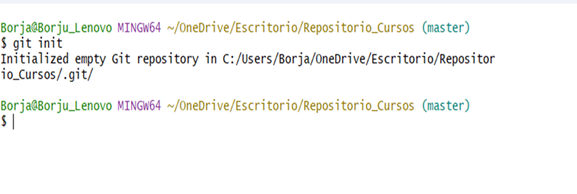
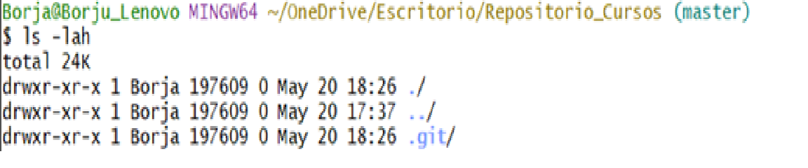
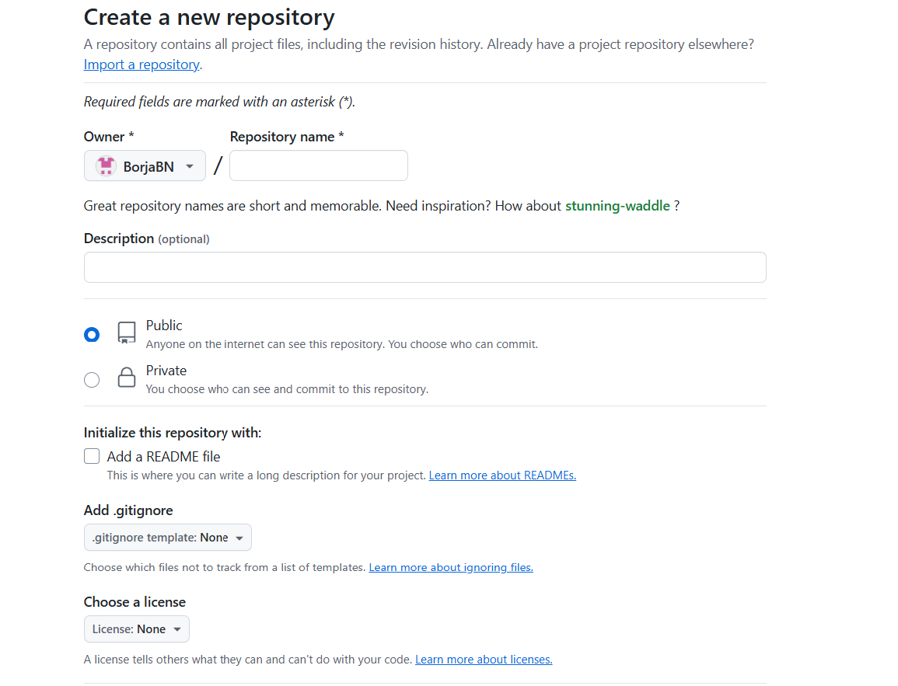
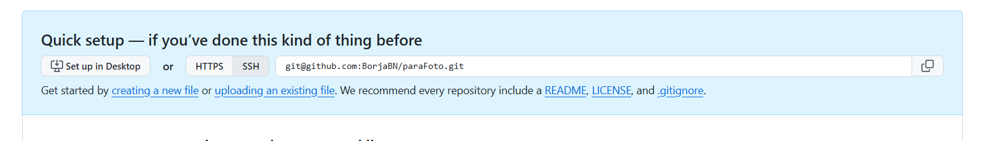
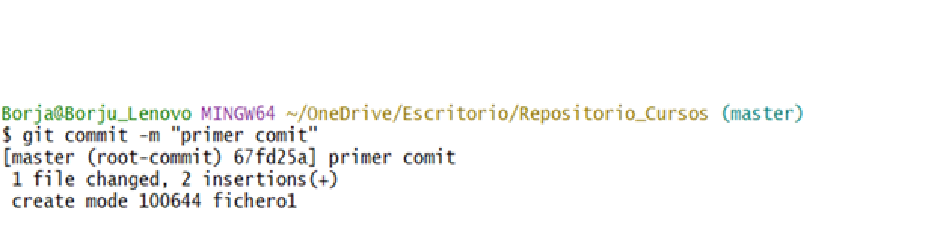
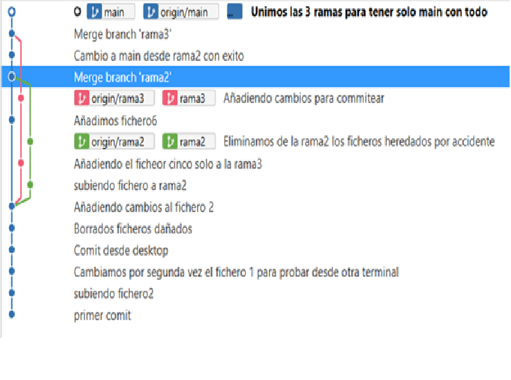
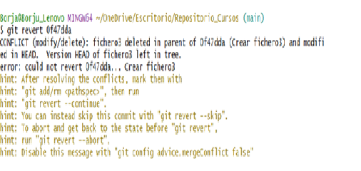
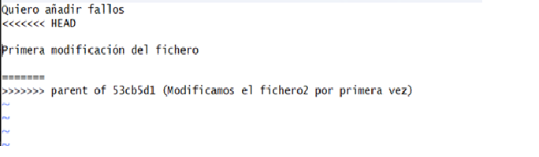
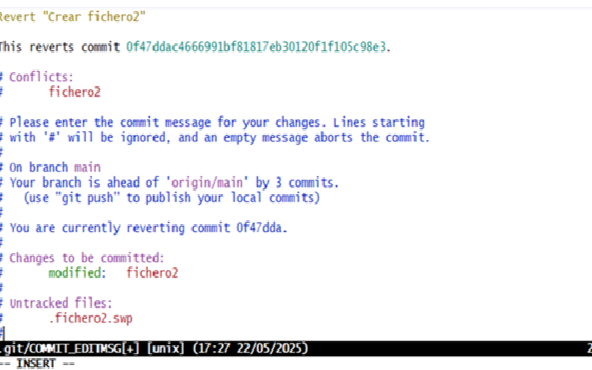

# Iniciación a Git

Se trata del Ejercicio 1.3 del plan de formación dual con el que se pretende familiriazar con Git 
y poder usarlo como herramienta de control de veriones. 

Este muestra las siguientes partes completadas:

- Inicializar un repositorio local y enlazarlo con GitHub.

- Realizar commits con mensajes claros.

- Crear ramas, fusionarlas y resolver conflictos simples Asignar recursos adecuados.

## 1- Inicializar un repositorio local.

Primero de todo, creamos en el escritorio de forma manual una carpeta a la hemos decidido llamar *"Repositorio_Cursos"*. Hacemos click sobre ella con el botón derecho y la abrimos con *git bash*, así se nos abrirá la consola de git con el path del repositorio directamente.

Lanzamos el comando **git init** para convertir la carpeta en un repositorio Git local; también nos crea dentro de este directorio una carpeta invisible llamada **.git**.

Con estas imagenes podemos ver que se ha creado el repositorio junto con su path y en la segunda imagen podemos ver como se ha creado la carpeta **.git** aunque no la veamos realmente al abrir la carpeta manualmente.

## 2- Enlazar el repositorio local con GitHub.

Nosotros al ya tener un repositorio remoto únicamente debemos de entrar en la pagina de GitHub y darle al botón de nuevo repositorio.

Nos salcrá esto mismo, donde le daremos nombre al reposirotio, lo haremos público o privado en función de lo que queramos y al haber hecho el paso anterior **no le debemos dar al botón de añadir un README**. (Tampoco necesitamos añadir un .gitignore o licencia)

Al bajar un poco más en la propia página aparece el botón de **crear reposirotio**, donde al pulsarlo nos mandarán aquí:

Donde deberemos de copiar la ruta SSH que nos pone para copiar en la ventana azul. Ahora, pasamos de nuevo a la consola de git Bash y lanzaremos los comandos como nos indica en la misma página.

1.  **git remote add origin** + la ruta copiada.
2.  **git branch -m main**
3.  **git push -u origin main**

Así habremos enlazado el repositorio local con el remoto de GitHub.

## 3- Realización de commits claros.

Cada vez que hagamos un cambio en el repositorio y añadirlo con **git add** es conveniente realizar un commit con el comando **git commit -m "__"** donde le añadimos el "-m" para darnos la posibilidad de crear un mensaje que pondremos entre comillas, intentando que sean lo más descriptivos posibles, bien para un posible futuro en el que posiblemente no nos acordemos con que estabamos trabajando en ese momento o bien en un posible caso de que trabajemos con un equipo y el resto de personas sepan que hemos hecho.

Este sería un ejemplo de como se viese el commit.

Existe un comando que nos será muy util a futuro y para ver los commits, **git log** con este comando podemos ver un historico de los commits que se han hecho en el repositorio donde podremos ver:

- Los commits existentes junto con sus hash.
- Quién hizo el commit.
- La fecha de cuando se hizo el commit.
- Y también el mensaje que se puso al commit.

## 4- Crear ramas y fusionarlas.

Podemos crear ramas bien con el comando **git branch nombreRama** donde nos crea la rama pero nos mantenemos en la rama en la que estabamos inicialmente, o bien **git checkout -b nombreRama** con el que crearemos la rama nueva y nos moveremos a dicha rama.

Para poder movernos entre ramas podemos utilizar **git checkout nombreRama** que nos moverá de una a otra igual que **git switch nombreRama**.

Una vez creada la rama hay que llevarla al repositorio remoto con **git push --set-upstream origin nombreRama**, para poder hacer push y pull fácilmente siempre que queramos.

Con la herramienta recomendada en los cursos del plan de formación se puede ver de una manera más vistosa el como se ha ido trabajando con las diferentes ramas, desde crearlas y añadirles diferentes archivos, hasta unirlas todas con main trayendo así sus archivos.

Para unir las diferentes ramas a una, primero debemos de encontrarnos en la rama a la que queremos traer la otra rama, una vez en la rama deseada lanzamos el comando **git merge nombreRama**, trayéndonos así su contenido a ésta.

Para que todo ocurra como en la foto anteriormente añadida, debemos cambiar un poco el comando, siendo: **git merge --no-ff nombreRama**, porque git utiliza un estilo por defecto que los cambios se ven todos en una sola línea, mientras que de la forma enseñada se ve de una manera más visual e intuitiva a simple vista.

## 5- Resolución de conflictos simples.

Con la intención de generar un conflicto para mostrar, se ha creado un fichero con **vim nombreFichero** al que hemos llamado fichero2, en el cual se ha escrito varias líneas y se ha commiteado correctamente, una vez hecho esto se ha procedido a borrar una línea de las escritas y se ha vuelto a commitear éste, continuamos repitiendo este último proceso y lo commiteamos por tercera vez. 

Ahora, vamos a revertir estos cambios con **git revert + 7 primeros difitos del hash del commit** (p.e.: git revert 4gh5j2m), debemos de añadirle el hash del commit al que queremos revertir, el cual veremos con **git log** como digimos anteriormente.

Esto nos ocasionará un problema, porque queremos volver a un contenido que actualmente está modificado, dándonos un error tal que así:

Esto nos viene a decir que existe un conflicto con el contenido del fichero y Git nos pide que hacer, desde eliminar el archivo, cancelar o continuar con el comando revert, nosotros queremos continuarlo por lo que vamos a entrar al archivo conflictivo y nos saldrá esto:

Lo que esto nos quiere decir es que en la parte de "HEAD" (el último commit) lo que se encuentra en el archivo y desde el "=" que es lo que queremos meter al haber aplicado el revert, entonces somos nosotros quienes decidimos con qué nos quedamos borrando las marcas de conflicto (<<<<<<<, =======, >>>>>>>) y dejando lo deseado.

Continuamos con el revert y éste nos mostrará un mensaje al solucionar el conflicto donde podremos escribir como un commit:

Para poder escirbir deberemos de pulsar "i" de "insert" y para guardarlo pulsaremos "scape" y lo guardaremos con ":wq" (w para guardar y q para cerrar el archivo).